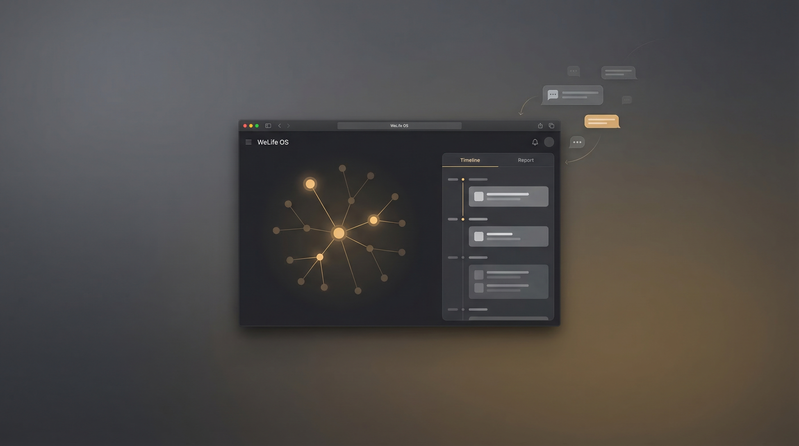
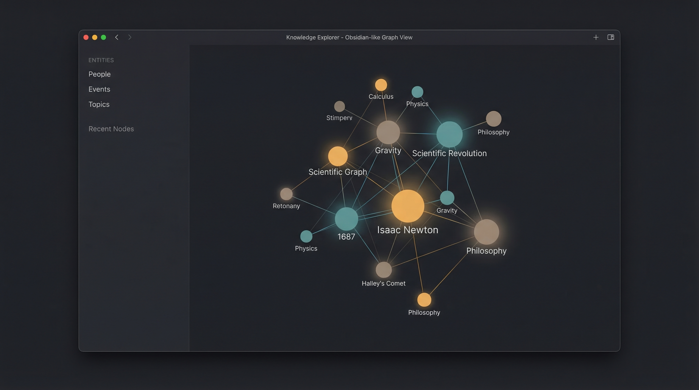
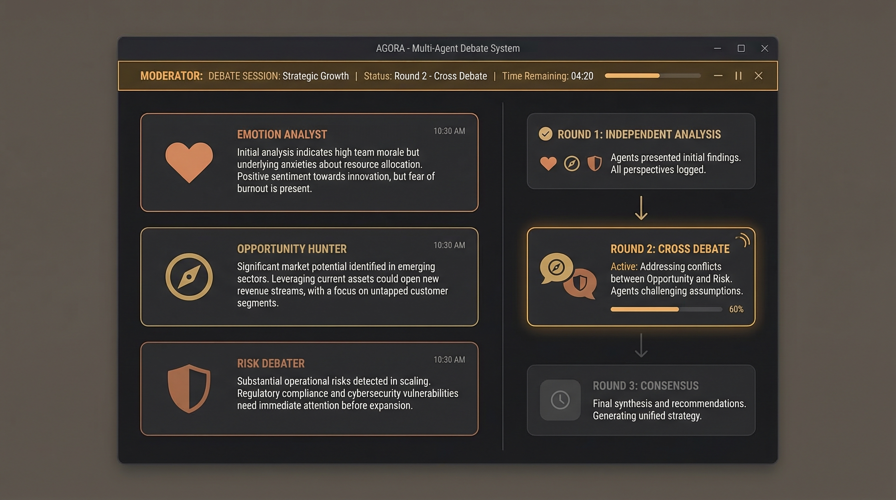
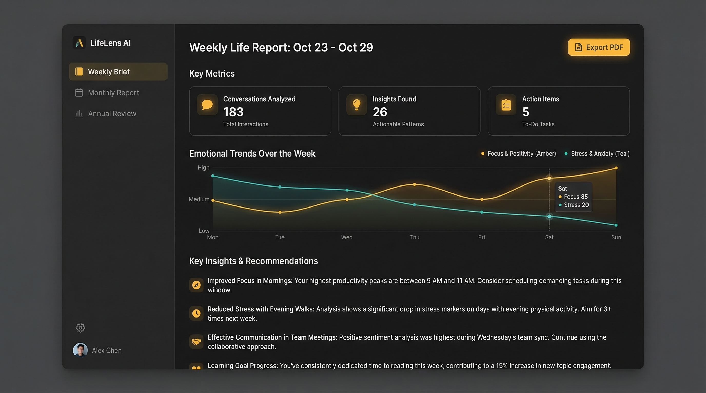
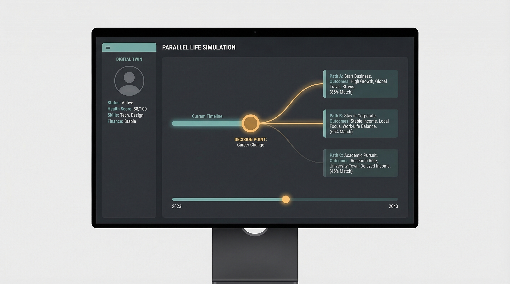

# WeLife OS — 人生第二大脑

> **把你散落在各处的聊天记录，变成一面照见人生全貌的镜子。**

<p align="center">
  
</p>

WeLife OS 是一个全本地运行的个人人生复盘系统。它从你的聊天记录中提取洞见，通过多 Agent 辩论产生深度分析，生成智能报告，甚至模拟「如果当时选了另一条路」的平行人生。

---

## 下载安装

前往 [GitHub Releases](https://github.com/Noasamaa/welife-os/releases) 下载对应平台的安装包：

| 平台 | 格式 |
|------|------|
| Windows | `.msi` / `.exe` |
| macOS (Apple Silicon) | `.dmg` |
| Linux | `.deb` / `.AppImage` |

> **前置依赖：** 需要安装 [Ollama](https://ollama.ai/) 并拉取模型：`ollama pull qwen3.5:9b`
>
> **macOS 注意：** 应用未签名，首次打开需右键 → "打开"。

---

## 核心特性

### 🧠 知识图谱

<p align="center">
  
</p>

### 🏛️ 多 Agent 辩论

<p align="center">
  
</p>

### 📊 智能报告

<p align="center">
  
</p>

### 🌌 平行人生模拟

<p align="center">
  
</p>

- **5 大 AI Agent** — 情感分析师、机会挖掘师、风险辩论团、执行教练、未来模拟师
- **ForumEngine 辩论引擎** — 三轮辩论（独立分析 → 交叉辩论 → 共识摘要）+ 主持人调度
- **ReACT 智能报告** — 每周简报 / 每月报告 / 年度复盘，ECharts 可视化 + PDF 导出
- **平行人生模拟** — 数字分身生成 + 多步关系网络演化 + 平行世界叙事
- **Obsidian 风格知识图谱** — WebGL 渲染 + 力导向布局 + 沉浸式全屏模式
- **执行教练** — Todoist 风格行动追踪 + 进度可视化 + 智能筛选
- **主动提醒系统** — 联系人维护提醒、行动到期提醒、周期性检查
- **8 大平台解析器** — 微信 / Telegram / WhatsApp / QQ / Discord / 飞书 / iMessage / 通用 CSV
- **全本地运行** — Ollama 驱动，SQLCipher 加密存储，零数据外泄
- **双主题** — 亮色 / 暗色 / 跟随系统

---

## 技术栈

| 层次 | 技术 |
|------|------|
| 桌面壳 | Tauri v2.10 (Rust) |
| 前端 | Vue 3.5 + TypeScript + Tailwind CSS 4 + ECharts + pixi.js |
| 后端 | Go 1.26 + chi/v5 |
| 本地 LLM | Ollama (推荐 qwen3.5:9b) / OpenAI 兼容 API |
| 加密存储 | SQLCipher (go-sqlcipher/v4) |
| 向量搜索 | sqlite-vec |
| 知识图谱 | gonum/graph + pixi.js WebGL |
| PDF 导出 | chromedp (无头 Chrome) |

---

## 架构

```
┌─────────────────────────────────────────────┐
│           Tauri v2 桌面壳 (Rust)              │
│  Vue 3 前端 · pixi.js 图谱 · ECharts 图表     │
└──────────────────┬──────────────────────────┘
                   │ HTTP / Sidecar
┌──────────────────▼──────────────────────────┐
│            Go 后端引擎 (单二进制)               │
│                                               │
│  数据导入层    Chat IR     知识图谱 (GraphRAG)   │
│  8 平台解析器  归一化处理   gonum + LLM 抽取     │
│                                               │
│  Agent 调度    ForumEngine   ReACT 报告        │
│  5 个 Agent    三轮辩论      PDF/HTML 导出      │
│                                               │
│  模拟引擎      提醒系统      异步任务管理         │
│  多步演化      周期调度      goroutine pool      │
│                                               │
│  SQLCipher 加密存储  ←→  Ollama / Cloud LLM   │
└─────────────────────────────────────────────┘
```

---

## 开发环境搭建

### 前置要求

- [Go 1.26+](https://go.dev/dl/)
- [Node.js 22+](https://nodejs.org/)
- [Ollama](https://ollama.ai/) 并拉取推荐模型：`ollama pull qwen3.5:9b`
- SQLCipher 开发库：
  - Ubuntu/Debian：`sudo apt install libsqlcipher-dev`
  - macOS：`brew install sqlcipher`

### 后端

```bash
cd engine
go mod download
go run ./cmd/welife
# 默认监听 127.0.0.1:18080
```

### 前端

```bash
cd tauri-app
npm install
npm run dev
# 浏览器打开 http://localhost:1420
```

### 桌面应用

```bash
cd tauri-app
npm run tauri:dev
```

### 验证

```bash
# 健康检查
curl http://127.0.0.1:18080/health

# 系统状态
curl http://127.0.0.1:18080/api/v1/system/status
```

---

## 支持的聊天平台

| 平台 | 格式 | 解析器 |
|------|------|--------|
| 微信 | CSV (WeChatMsg / 官方导出) | `wechat_csv` |
| Telegram | JSON (官方导出 / AyuGram) | `telegram_json` |
| WhatsApp | TXT (聊天导出) | `whatsapp_txt` |
| QQ | TXT (QQ 导出助手) | `qq_export` |
| Discord | JSON (DiscordChatExporter) | `discord_json` |
| 飞书 | JSON (飞书导出) | `lark_json` |
| iMessage | SQLite (macOS chat.db) | `imessage_db` |
| 通用 | CSV | `generic_csv` |

> **Telegram 注意：** 需导出为 JSON 格式（Machine-readable），HTML 格式暂不支持。

---

## API 端点概览

| 方法 | 路径 | 说明 |
|------|------|------|
| GET | `/api/v1/tasks/{id}` | 查询异步任务状态 |
| POST | `/api/v1/import` | 上传并导入聊天文件 |
| POST | `/api/v1/graph/build` | 触发知识图谱构建 |
| POST | `/api/v1/forum/debate` | 触发多 Agent 辩论 |
| POST | `/api/v1/reports/generate` | 生成 AI 报告 |
| GET | `/api/v1/reports/{id}/pdf` | 导出报告 PDF |
| POST | `/api/v1/coach/generate-plan` | 生成行动计划 |
| POST | `/api/v1/simulation/run` | 运行平行人生模拟 |
| GET | `/api/v1/reminders/pending` | 获取待处理提醒 |

完整 API 路由定义请查看 [routes.go](./engine/internal/server/routes.go)。

---

## 隐私设计

1. **数据不出设备** — 全部处理在本地完成
2. **本地优先** — 默认 Ollama 本地推理，支持可选云端 LLM
3. **加密存储** — SQLCipher AES-256 加密数据库
4. **无遥测** — 不收集任何使用数据
5. **密钥自动管理** — 首次启动自动生成，权限 0600

---

## 许可证

[AGPL-3.0](./LICENSE) — 允许自由使用和修改，但要求衍生作品同样开源。禁止私自闭源商用。

## 贡献

欢迎贡献！请阅读 [CONTRIBUTING.md](./CONTRIBUTING.md) 了解开发流程。
